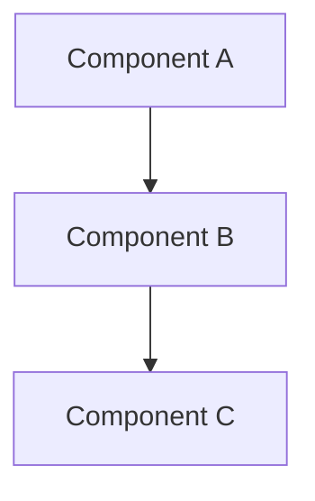

# Project Report

> **Instructions**:
> This template provides the structure for your project report.
> Replace the placeholder text with your actual content.
> Remove instructions that are not relevant for your project, but leave the headings along with a (NA) label.

## Project Overview

**Project Name**: [Your project name]

**Group Members**:

- Student number, Name, GitHub username
- Student number, Name, GitHub username
- Student number, Name, GitHub username

**Brief Description**:
[2-3 sentences describing what your application does and its main purpose]

## Architecture Overview

### High-Level Architecture

[Describe the overall system architecture. Consider including a diagram using mermaid or linking to an image]



### Components

- **Component 1**: [Description of what this component does]
- **Component 2**: [Description of what this component does]
- **Component 3**: [Description of what this component does]

### Technologies Used

- **Backend**: [e.g., Go, Node.js, Python]
- **Database**: [e.g., PostgreSQL, MongoDB, Redis]
- **Cloud Services**: [e.g., AWS EC2, Google Cloud Run, Azure Functions]
- **Container Orchestration**: [e.g., Docker, Kubernetes]
- **Other**: [List other significant technologies]

## Prerequisites

### System Requirements

- Operating System: [e.g., Linux, macOS, Windows]
- Minimum RAM: [e.g., 8GB]
- Storage: [e.g., 10GB free space]

### Required Software

- [Software 1] (version X.X or higher)
- [Software 2] (version X.X or higher)
- [etc.]

### Dependencies

```bash
# List key dependencies that need to be installed
# For example:
# Docker Engine 20.10+
# Node.js 18+
# Go 1.25+
```

## Build Instructions

### 1. Clone the Repository

```bash
git clone [your-repository-url]
cd [repository-name]
```

### 2. Install Dependencies

```bash
# Provide step-by-step commands
# For example:
# npm install
# go mod download
```

### 3. Build the Application

```bash
# Provide exact build commands
# For example:
# make build
# docker build -t myapp .
```

### 4. Configuration

```bash
# Any configuration steps needed
# Environment variables to set
# Configuration files to create
```

## Deployment Instructions

### Local Deployment

```bash
# Step-by-step commands for local deployment
# For example:
# docker-compose up -d
# kubectl apply -f manifests/
```

### Cloud Deployment

```bash
# Commands for cloud deployment
# Include any cloud-specific setup
```

### Verification

```bash
# Commands to verify deployment worked
# How to check if services are running
# Example health check endpoints
```

## Testing Instructions

### Unit Tests

```bash
# Commands to run unit tests
# For example:
# go test ./...
# npm test
```

### Integration Tests

```bash
# Commands to run integration tests
# Any setup required for integration tests
```

### End-to-End Tests

```bash
# Commands to run e2e tests
# How to set up test environment
```

## Usage Examples

### Basic Usage

```bash
# Examples of how to use the application
# Common commands or API calls
# Sample data or test scenarios
```

### Advanced Features

```bash
# Examples showcasing advanced functionality
```

---

## Presentation Video

**YouTube Link**: [Insert your YouTube link here]

**Duration**: [X minutes Y seconds]

**Video Includes**:

- [ ] Project overview and architecture
- [ ] Live demonstration of key features
- [ ] Code walkthrough
- [ ] Build and deployment showcase

## Troubleshooting

### Common Issues

#### Issue 1: [Common problem]

**Symptoms**: [What the user sees]
**Solution**: [Step-by-step fix]

#### Issue 2: [Another common problem]

**Symptoms**: [What the user sees]
**Solution**: [Step-by-step fix]

### Debug Commands

```bash
# Useful commands for debugging
# Log viewing commands
# Service status checks
```

---

## Self-Assessment Table

> Be honest and detailed in your assessments.
> This information is used for individual grading.
> Link to the specific commit on GitHub for each contribution.

| Task/Component                                                      | Assigned To | Status        | Time Spent | Difficulty | Notes       |
| ------------------------------------------------------------------- | ----------- | ------------- | ---------- | ---------- | ----------- |
| Project Setup & Repository                                          | [Name]      | ✅ Complete    | [X hours]  | Medium     | [Any notes] |
| [Design Document](https://github.com/dat515-2025/group-name)         | [Name]      | ✅ Complete    | [X hours]  | Easy       | [Any notes] |
| [Backend API Development](https://github.com/dat515-2025/group-name) | [Name]      | ✅ Complete    | [X hours]  | Hard       | [Any notes] |
| [Database Setup & Models](https://github.com/dat515-2025/group-name) | [Name]      | ✅ Complete    | [X hours]  | Medium     | [Any notes] |
| [Frontend Development](https://github.com/dat515-2025/group-name)    | [Name]      | 🔄 In Progress | [X hours]  | Medium     | [Any notes] |
| [Docker Configuration](https://github.com/dat515-2025/group-name)    | [Name]      | ✅ Complete    | [X hours]  | Easy       | [Any notes] |
| [Cloud Deployment](https://github.com/dat515-2025/group-name)        | [Name]      | ✅ Complete    | [X hours]  | Hard       | [Any notes] |
| [Testing Implementation](https://github.com/dat515-2025/group-name)  | [Name]      | ⏳ Pending     | [X hours]  | Medium     | [Any notes] |
| [Documentation](https://github.com/dat515-2025/group-name)           | [Name]      | ✅ Complete    | [X hours]  | Easy       | [Any notes] |
| [Presentation Video](https://github.com/dat515-2025/group-name)      | [Name]      | ✅ Complete    | [X hours]  | Medium     | [Any notes] |

**Legend**: ✅ Complete | 🔄 In Progress | ⏳ Pending | ❌ Not Started

## Hour Sheet

> Link to the specific commit on GitHub for each contribution.

### [Team Member 1 Name]

| Date      | Activity            | Hours      | Description                         |
| --------- | ------------------- | ---------- | ----------------------------------- |
| [Date]    | Initial Setup       | [X.X]      | Repository setup, project structure |
| [Date]    | Backend Development | [X.X]      | Implemented user authentication     |
| [Date]    | Testing             | [X.X]      | Unit tests for API endpoints        |
| [Date]    | Documentation       | [X.X]      | Updated README and design doc       |
| **Total** |                     | **[XX.X]** |                                     |

### [Team Member 2 Name]

| Date      | Activity             | Hours      | Description                               |
| --------- | -------------------- | ---------- | ----------------------------------------- |
| [Date]    | Frontend Development | [X.X]      | Created user interface mockups            |
| [Date]    | Integration          | [X.X]      | Connected frontend to backend API         |
| [Date]    | Deployment           | [X.X]      | Docker configuration and cloud deployment |
| [Date]    | Testing              | [X.X]      | End-to-end testing                        |
| **Total** |                      | **[XX.X]** |                                           |

### [Team Member 3 Name] (if applicable)

| Date      | Activity                 | Hours      | Description                      |
| --------- | ------------------------ | ---------- | -------------------------------- |
| [Date]    | Database Design          | [X.X]      | Schema design and implementation |
| [Date]    | Cloud Configuration      | [X.X]      | AWS/GCP setup and configuration  |
| [Date]    | Performance Optimization | [X.X]      | Caching and query optimization   |
| [Date]    | Monitoring               | [X.X]      | Logging and monitoring setup     |
| **Total** |                          | **[XX.X]** |                                  |

### Group Total: [XXX.X] hours

---

## Final Reflection

### What We Learned

[Reflect on the key technical and collaboration skills learned during this project]

### Challenges Faced

[Describe the main challenges and how you overcame them]

### If We Did This Again

[What would you do differently? What worked well that you'd keep?]

### Individual Growth

#### [Team Member 1 Name]

[Personal reflection on growth, challenges, and learning]

#### [Team Member 2 Name]

[Personal reflection on growth, challenges, and learning]

#### [Team Member 3 Name] (if applicable)

[Personal reflection on growth, challenges, and learning]

---

**Report Completion Date**: [Date]
**Last Updated**: [Date]
